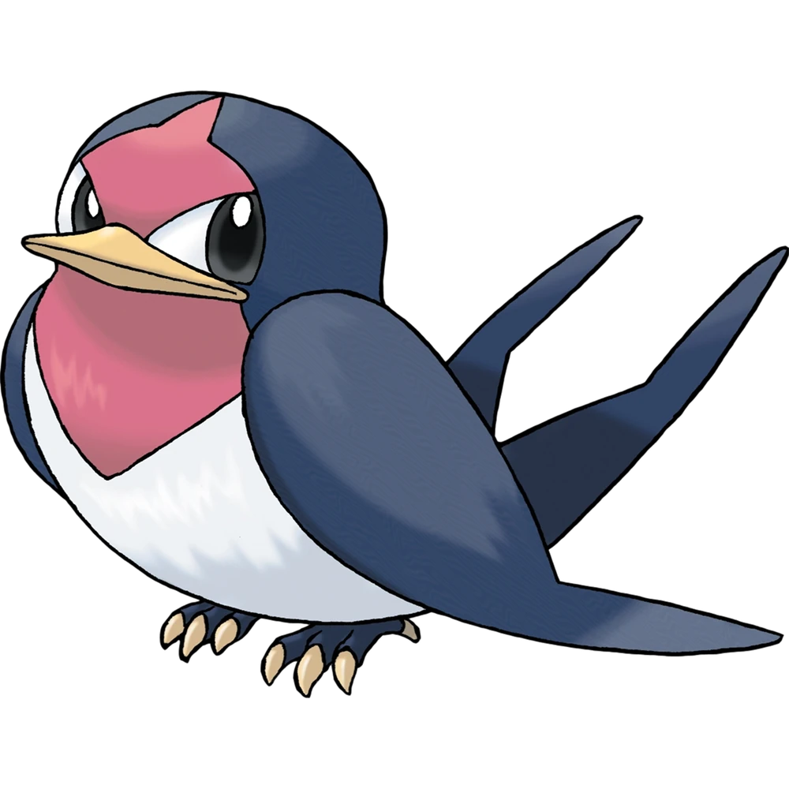
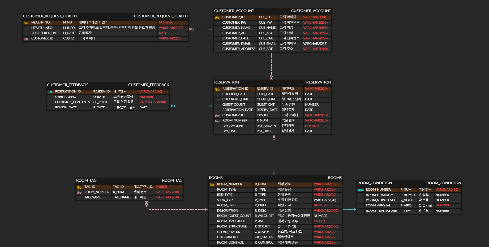

# CHOOROOM Project (by. 현이와아이들)    🙌 안녕하세요. CHOOROOM에 오신걸 환영합니다.

## 목차
[1. 👪 서비스 기획 및 개발 멤버 소개](#서비스-기획-및-개발-멤버-소개)

[2. 📆 프로젝트 기간](#프로젝트-기간)

[3. 💡 서비스 소개](#서비스-소개)

[4. 주요기능](#주요기능)

[5. 기술스택](#기술스택)

[6. 시스템 아키텍처](#시스템-아키텍처)

[7. 유스케이스](#유스케이스)

[8. 서비스 흐름도](#서비스-흐름도)

[9. ER 다이어그램](#ER-다이어그램)

[10. 화면구성](#화면구성)

[12. 트러블슈팅](#트러블슈팅)

    

 

## 👪 서비스 기획 및 개발 멤버 소개
<table>
	<tr>
		<td width="20%" height="220px" align="center">
			<a href="https://github.com/WhoingYang">
			
		    
			🤴🏻 양현 (팀장, 첫째)  (Back-End, Front-end) </a>  
		</td>
    <td width="20%" height="220px" align="center">
	    <a href="https://github.com/Moonhyunjiii">
	    
	      
	    👸🏻 문현지 (팀원, 둘째)  (Back-End, Front-end) </a>  
    </td>
    <td width="20%" height="220px" align="center">
	    <a href="https://github.com/HayunKwon">
	    
	      
	    🤴🏻 권하윤 (팀원, 셋째)  (Front-End, 기획) </a>  
    </td>
    <td width="20%" height="220px" align="center">
	    <a href="https://github.com/olaf-01">
	    
	      
	    👸🏻 송민제 (팀원, 넷째)  (Front-End, 기획) </a>  
    </td>
    <td width="20%" height="220px" align="center">
	    <a href="https://github.com/tweety27">
	    
	      
	    👸🏻 김서연 (팀원, 막내)  (Back-End, Front-end) </a>  
    </td>
	</tr> 
	<tr>
		<td width="20%" align="center">DB 설계 제작, 사용자 예약확인 페이지 개발</td>
		<td width="20%" align="center">메인페이지, 필터, 해시태그 기능 개발</td>
		<td width="20%" align="center">관리자 대시보드 개발 , 모든 페이지 프론트 디자인(css)</td>
		<td width="20%" align="center">화면설계서 작성, UX/UI 설계 및 디자인, 관리자 대시보드, 유저 예약 확정 페이지 구현 (css)</td>
		<td width="20%" align="center">로그인(로그아웃) 페이지, 회원 가입 페이지, 객실 상세 정보 페이지 개발, 객실 예약 버튼 구현</td>
	</tr>
</table>

 

## 📆 프로젝트 기간

### 24.09.05 ~ 24.09.13

- 문제 정의 및 서비스 기획 : 24.09.05 ~ 24.09.06
- 화면 기획, DB 구조 설계 : 24.09.09 ~ 24.09.10
- 프로젝트 구현 : 24.09.10 ~ 24.09.13
- 오류 수정 및 산출물 정리 : 24.09.13 ~ 24.09.13

 

## 💡 서비스 소개

### Make perfect moment, Chooroom.

Chooroom은 호텔에 설치된 LG가전 데이터로 기기를 효율적으로 관리하고, 고객에게 데이터를 공개하여 선택한 방의 컨디션을 투명하게 볼 수 있도록 하여 고객에게 차별화된 경험을 선사하고자 합니다.

- Choose : 고객이 자신이 선택한 방의 컨디션을 투명하게 볼 수 있도록 하자
- Your : 고객에게 개인화되고 차별화된 서비스를 제공해주자
- Room : 호텔관계자가 객실 퀄리티를 객관적으로 확인 할 수 있게 하자

 

## 주요기능

**ID**: LOGIN_01

**유스케이스 이름**: 일반로그인

**우선순위**: 하

**이벤트 흐름**:

- 사용자가 정보를 유효하지 않게 입력할 경우, 로그인은 실패하고, 올바른 정보를 입력하라는 메시지가 출력된다.
- 사용자 정보(아이디, 패스워드)가 유효할 경우, 로그인 버튼 클릭 시 메인 홈 화면으로 이동한다.
- 회원가입 버튼 클릭 시 회원가입 페이지로 이동한다.

**종료 조건**:

로그인 버튼 클릭 시, 회원가입 버튼 클릭 시

---

**ID**: JOIN_01

**유스케이스 이름**: 회원가입

**우선순위**: 상

**이벤트 흐름**:

- 사용자가 로그인 페이지에서 회원가입 버튼을 클릭하면, 회원가입 페이지로 이동한다.
- 사용자가 모든 정보를 유효하게 입력할 경우, 회원가입이 완료되고 로그인 창으로 이동한다.
- 아이디 중복 검사 버튼 클릭 시 유효한 아이디인지 확인 후 팝업 알림이 뜬다.
- 입력된 정보가 유효하지 않을 경우, 회원가입이 실패하고 올바른 정보를 입력하라는 메시지가 표시된다.
- 뒤로 가기 버튼을 클릭하면 로그인 창으로 이동한다.

**종료 조건**:

회원가입 완료 시, 뒤로 가기 버튼 클릭 시

---

**ID**: BOOKING_01

**유스케이스 이름**: 예약 및 결제 화면

**우선순위**: 하

**이벤트 흐름**:

- 결제가 성공하면 예약 확인 화면으로 이동한다.
- 회원가입 시 입력한 개인 정보 불러오기를 완료한 후, 결제 시 자동으로 예약자 정보를 입력한다.
- 추가 요구사항을 입력할 경우, '예약 버튼'이 비활성화되며 예약이 완료된다.
- 취소 및 재시작 버튼을 누르면 처음 화면으로 이동한다.

**종료 조건**:

결제 취소 시, 결제 완료 시

---

**ID**: BOOKING_02

**유스케이스 이름**: 예약 상세내역 확인

**우선순위**: 상

**이벤트 흐름**:

- 결제 완료 후 호텔 예약 정보와 오류 사항에 대한 정보가 표시된다.
- 창 닫기 버튼을 클릭 시 메인 화면으로 이동한다.
- 예약 버튼 클릭 시, 예약 상세 확인 화면으로 이동한다.

**종료 조건**:

창 닫기 클릭 시, 체크인 버튼 클릭 시

---

**ID**: MAIN_01, MAIN_02, MAIN_03, MAIN_04, MAIN_05, MAIN_06

**유스케이스 이름**: 메인화면

**우선순위**: 상

**이벤트 흐름**:

1. 날짜, 객실 수, 인원 수를 입력 후 검색 버튼을 클릭 시 예약 가능한 객실만 화면에 표시된다.
2. 예약 가능 여부에 따라 선택할 수 있는 객실이 다르게 표시된다:
    - 객실 예약이 가능하면 예약 버튼이 활성화된다.
    - 객실이 예약 불가 시, 객실을 선택할 수 없다.
    - 체크인, 체크아웃 및 인원 수는 조건에 따라 자동으로 수정된다.
3. 특실, 스위트룸 등의 추가 서비스는 객실 예약 조건에 맞는 사용자의 요청 시 함께 처리된다.
4. 등급별(스탠다드, 디럭스, 스위트 등) 객실 예약 상황과 관리 상태가 함께 조회된다.
    - 관리 데이터는 DB에서 불러온다.
    - 데이터는 매일 1회 업데이트된다.
    - 관리 상태는 admin 페이지에서 수동으로 업데이트 가능하다.

**종료 조건**:

브라우저 종료

이대로 깃헙에 추가할거야
    

## 기술스택
### Front

<!-- HTML5 -->
  

### Back

 

### 협업툴

<!-- Figma -->
 

    

## 시스템 아키텍처

    

## 유스케이스
[유저 페이지]

- 필터 기능 : 필터 클릭 시, 원하는 특성을 가진 객실을 노출시킵니다. 1차 필터에서 해당 호텔만의 차별성 있는 선택지를 선택하고, 2차 필터로 ‘뷰’, ‘침대’, ‘가격’ 등 일반적으로 객실 선택 시 고려하는 사항들을 선택할 수 있습니다.
- 회원가입 기능 : 아이디 중복 검사를 통해 중복이 없을 경우 DB에 저장하고, 이후 해당 아이디로 시스템에 접근 가능하도록 구현했습니다.
- 로그인 기능 :  아이디와 비밀번호를 확인해 유효한 경우에만 로그인 허용하며, 로그인 후 로그아웃 버튼 클릭 시 세션 종료 후 메인 페이지로 리다이렉트 됩니다.
- 예약상세페이지 : 유저가 예약한 방번호와 일치하는 청정도 수치 정보를 DB로부터 불러와 시각화, 유저가 회원가입시 입력한 특정건강정보 표시됩니다. DB에 있는 해당 방의 청소상태 확인 기능 및 그에 따른 체크인 버튼이 활성화됩니다. 체크인 버튼 클릭 시 IOT 페이지로 넘어가는 버튼 활성화됩니다.

[어드민 페이지]

- 메인 대시보드 : 관리자가 한눈에 다가오는 예약, 객실사용현황, 청소가 필요한 방, 방별 기기 관리 현황 등을 한눈에 볼 수 있게 되어  있고 사이드바에는 객실 제품 기기관리 호텔관리 에너지 관리 객실관리의 상세 페이지로 이동이 가능하도록 구현. 각 호실의 정보가 보여지는 세부 페이지로 이동할 수 있는 링크를 포함하여 간편하게 각 방의 상태를 점검할 수 있습니다.
- 객실 기기관리 : 객실들의 평균적인 종합 청정도를 확인하고, 객실별 룸 컨디션 (습도, 온도, 공기질 등)와 객실별 기기 운영 현황을 한눈에 파악할 수 있습니다. 냉장고, 에어컨 등 객실 필수 기기에 대한 ON/OFF 정보, 설정 온도 등을 확인할 수 있ㅅ브니다. 관리가 필요한 객실 기기는 상단에 빨간 색상과 함께 노출됩니다. 객실별 데이터를 한페이지에 보여주어 관리가 용이하도록 합니다.

    

## 서비스 흐름도

    

## ER 다이어그램

    

## 화면구성

    

## 결과물
### CHOOROOM 유저 화면

### CHOOROOM 관리자ㅎ 화면

